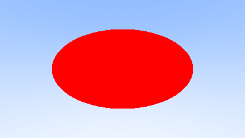
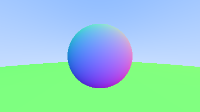
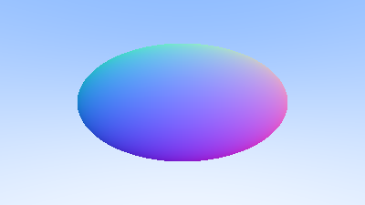

# Building my own 3d renderer


## Kray Features

- **Physically-based rendering** with accurate light simulation

- **Camera system** with:
  - Configurable field of view
  - Depth of field (defocus blur)
  - Positionable camera with look-at targeting
- **Anti-aliasing** via multi-sample rendering
- **Sphere primitive** with ray-sphere intersection

## Tech Stack

| Technology | Purpose |
|------------|---------|
| C++ | Core language |
| CMake | Build system |
| PPM | Image output format |


##  Getting Started

### Prerequisites

- C++ compatible compiler (GCC, Clang, or MSVC)
- CMake 3.1 or higher

### Building

```bash
# Clone the repository
git clone https://github.com/utmp/3d-renderer
cd 3d-renderer

# Create build directory and compile
cmake -B build
cmake --build build
```

### Running

```bash
# write raw pixel to ppm file
./Kray.exe > output.ppm
```

## Examples









## Resources

- [Ray Tracing in One Weekend](https://raytracing.github.io/books/RayTracingInOneWeekend.html) - The original book


##  License

This project is created for educational purposes as part of the **Build Your Own X** challenge.

---

<p align="center">
  Made with ❤️ and lots of rays
</p>